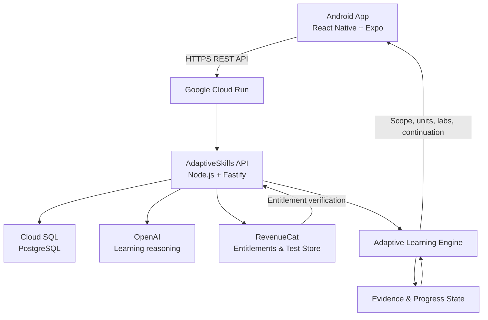

# AdaptiveSkills

<p align="center">
  
</p>

<p align="center"><strong>Learn. Build. Grow.</strong></p>
<p align="center"><strong>Learn what matters. Prove what you know. Adapt what comes next.</strong></p>

AdaptiveSkills is an AI-driven adaptive skill-development platform that turns a learner's real goal into a personalized learning scope, teaches the required concepts, tests capability through practical labs, collects learning evidence, and uses that evidence to determine what should come next.

Built for the **RevenueCat Ship-a-ton 2026 — Next Gen Award**.

> **Current platform:** Android mobile app built with React Native and Expo. iOS and web are future directions.

## Try the current build

- **Android build:** [Open the production EAS build](https://expo.dev/accounts/adaptive-labs/projects/adaptive-skills/builds/fa2b3a14-c004-4076-b576-a2af6a607ec6)
- **Public API:** [adaptiveskills-api-236264514374.asia-south1.run.app](https://adaptiveskills-api-236264514374.asia-south1.run.app)
- **API health:** [Check `/health`](https://adaptiveskills-api-236264514374.asia-south1.run.app/health)
- **Source:** [github.com/khushira2244/AdaptiveSkills](https://github.com/khushira2244/AdaptiveSkills)

## Why AdaptiveSkills

Most learning products give everyone a fixed course. AdaptiveSkills starts from the learner's actual goal, existing skills, experience, selected depth, and target. A target can be a role, a product direction, or a job description.

The system analyzes that target into capabilities, sub-skills, concepts, dependencies, and practical abilities. It compares that scope with what the learner already knows, then builds only the learning runway currently needed.

## How the adaptive loop works

```text
Goal / JD
    ↓
Deep capability analysis
    ↓
Skill and concept scope
    ↓
Learner confirms scope and depth
    ↓
Focused learning unit
    ↓
Practical lab
    ↓
Evidence
    ↓
Adaptation
    ↓
Next learning runway
```

V1 materializes a small learning runway instead of generating an entire course upfront. The current `TRY_IT` runway contains **two coherent learning units with practical labs**.

After that initial runway, continuation analysis considers:

- the original learning goal and remaining skill scope;
- the selected learning depth;
- completed concepts and lab results;
- independent work and work completed with hints or assistance;
- demonstrated capabilities; and
- unresolved learning gaps.

AdaptiveSkills uses that evidence to propose the next runway rather than moving the learner through a fixed syllabus. Detailed teaching is prepared progressively, one upcoming unit at a time.

## V1 capabilities

V1 focuses on technical and software skill development, including frontend, backend, APIs, databases, cloud, DevOps, system design, AI/application engineering, and related programming skills.

The current product supports:

- email/password accounts and resumable onboarding;
- learner profiles, existing skills, goals, interests, pace, and learning depth;
- optional résumé and job-description context;
- AI-generated capability maps, concept scope, focused teaching, and labs;
- learner review of the proposed scope before unit generation;
- persisted unit, lesson, and lab progress;
- evidence-aware continuation planning; and
- access management through RevenueCat.

The learning and evidence model is intentionally generic so that additional learning domains can be added later.

## Practical labs

Learning does not end with theory. Each unit can lead to a practical lab containing:

- a scenario, goal, and evaluation criteria;
- provided or read-only supporting files;
- learner-editable **YOU BUILD** files;
- a mobile code workspace with multiline editing;
- saved drafts and autosave;
- **Run checks** results;
- up to two file-specific hints; and
- final submission.

Lab evidence distinguishes work completed independently, work completed with assistance, and capability that has not yet been demonstrated. That evidence feeds the learner's progress and continuation analysis.

## Notes, markers, and doubts

While reading, learners can select text to:

- save a note;
- mark an important word or selection;
- signal **I know this** or **I don't understand**; and
- request a deeper explanation.

Notes, marked words, lesson progress, and doubts persist. Unresolved doubts can receive focused clarification or be carried into later learning and lab planning.

## RevenueCat integration

RevenueCat is the product's access and entitlement layer. The adaptive-learning engine remains on the AdaptiveSkills backend and uses learner state and evidence to plan instruction.

| Stage | Offering | Package | Entitlement | Product |
| --- | --- | --- | --- | --- |
| Initial learning access | `default` | Selected initial package | `adaptive_labs_pro` | Configured initial product |
| Continuation runway | `continuation` | `growth_runway` | `adaptive_labs_growth` | `adaptive_labs_growth_799` |

The continuation flow is:

```text
Initial learning access
→ adaptive_labs_pro
→ complete the initial runway
→ continuation analysis
→ preview the next runway
→ RevenueCat continuation purchase
→ backend verifies adaptive_labs_growth
→ backend activates the next runway
→ return to Home
→ Continue Learning
```

The backend verifies entitlement state before activating a runway; the app does not grant access from a client callback alone. Purchase reconciliation is idempotent, and an already-active entitlement can restore access after the app restarts.

The current hackathon build uses the **RevenueCat Test Store** for success, cancellation, failure, and restore testing. Real Google Play billing is not enabled in this build.

## Architecture



PostgreSQL is authoritative for learner, progress, teaching, lab, evidence, and commerce state. The Android client stores its session securely and resumes from backend-owned state.

## Technology

| Area | Stack |
| --- | --- |
| Mobile | React Native, Expo, TypeScript |
| Mobile security | Expo SecureStore |
| API | Node.js, Fastify, TypeScript, Zod |
| Database | PostgreSQL, SQL migrations |
| AI reasoning | OpenAI Responses API |
| Purchases | RevenueCat SDK, webhooks, server-side reconciliation |
| Production infrastructure | Google Cloud Run, Cloud SQL |
| Android builds | EAS Build |

## Repository structure

```text
apps/mobile/          Android React Native / Expo application
services/api/         Fastify HTTP API and learning services
packages/contracts/   Shared request and response schemas
packages/db/          PostgreSQL migrations, repositories, and DB tests
packages/domain/      Shared learning-domain package
scripts/              Local environment and Android helper scripts
```

## Run locally

### Prerequisites

- Node.js 22.14 or newer
- npm
- PostgreSQL 17, or Docker with Compose
- Android Studio/emulator or an Android device for the mobile app

### 1. Install and configure

```powershell
npm ci
npm run local:configure
```

`local:configure` creates an untracked `.env` with separate local database and authentication secrets. It refuses to overwrite an existing file. Review [`.env.example`](.env.example) for every supported setting.

Never commit `.env` or server credentials. Only `EXPO_PUBLIC_API_URL` and the RevenueCat **public** SDK key belong in the mobile environment. Database, OpenAI, RevenueCat secret API, webhook, and authentication secrets remain server-side.

### 2. Start PostgreSQL and the API

```powershell
docker compose up -d --wait postgres
npm run db:check
npm run db:migrate
npm start
```

The local API listens on `http://127.0.0.1:3000`. Its health endpoint is `http://127.0.0.1:3000/health`.

### 3. Start the Android app

Configure `apps/mobile/.env` from [`apps/mobile/.env.example`](apps/mobile/.env.example), then run:

```powershell
npm run mobile:start
```

Press `a` to open the Android emulator. Android emulators use `http://10.0.2.2:3000` to reach the development machine. Physical devices need a reachable LAN or HTTPS API URL.

Production builds require `EXPO_PUBLIC_API_URL`; they do not fall back to the emulator address.

## Verification

```powershell
npm run typecheck
npm test
npm run mobile:test
npm run test:db
```

`npm run test:db` requires `DATABASE_URL` for a dedicated PostgreSQL test database with permission to create schemas. Tests create isolated schemas and remove only those schemas.

To create the current internal-distribution Android APK with the EAS production environment:

```powershell
cd apps/mobile
npx eas-cli build --platform android --profile production-apk
```

## Current scope

AdaptiveSkills V1 is an Android-first hackathon build for technical skill development. The current purchase experience uses RevenueCat Test Store. iOS, web, additional learning domains, and real Google Play billing are future directions rather than completed product claims.
