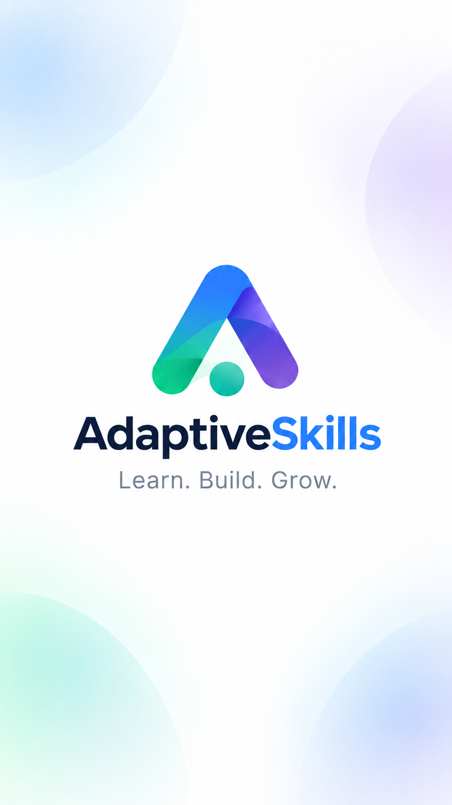
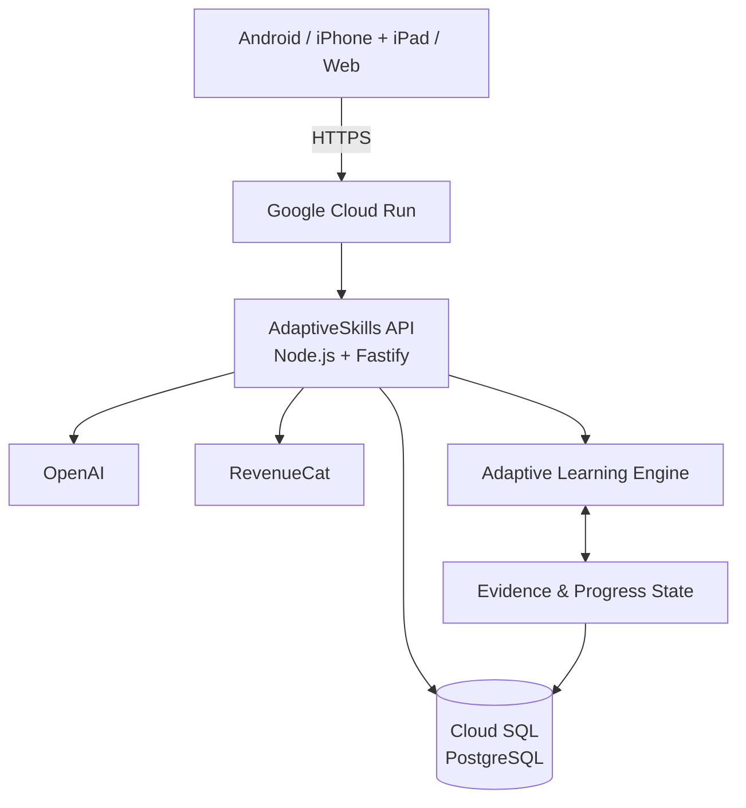

# AdaptiveSkills

<p align="center">
  
</p>

<p align="center"><strong>Learn. Build. Grow.</strong></p>

AdaptiveSkills is a goal-first adaptive learning platform that turns what a learner wants to achieve into a personalized path of focused concepts, hands-on labs, evidence, and adaptive next steps.

## What AdaptiveSkills does

A learner creates an account, optionally uploads a CV or resume, reviews the extracted skills, and adds or removes anything needed. They then describe a goal, target role, product direction, or job-description context. AdaptiveSkills analyzes the gap between that target and the learner's existing skills and proposes a learning scope.

The learner can keep or remove flexible recommendations and select the supported learning depth. The first runway then provides exactly **two focused learning units and two hands-on labs**. Concepts are completed sequentially. During teaching, learners can save notes, mark terms, record doubts, and request clarification. A lab follows each unit and provides exactly two normal hints, plus separate System Assistance where supported.

Lab evidence records what the learner completed independently, completed with assistance, or did not demonstrate. Progress, evidence, known concepts, and remaining gaps shape the next adaptive runway. Continuation access unlocks that proposed runway.

## Who it is for

AdaptiveSkills currently serves students and freshers, job seekers, career switchers, working professionals, and self-directed learners.

Its current focus is software and technical skill development: backend and frontend engineering, APIs, databases, system design, cloud, DevOps, applied AI, and related engineering skills. The architecture is designed to expand into additional practical skill domains later; those future domains are not claimed as implemented today.

## Why AdaptiveSkills is different

- **Goal-first:** the path begins with an outcome, not a fixed course catalog.
- **Aware of existing skills:** the learner reviews what resume extraction found before planning begins.
- **Learner-shaped scope:** recommendations, dependencies, known areas, and depth remain visible before generation.
- **Teaching plus practice:** focused concepts lead directly to hands-on labs.
- **Evidence-based progress:** independent and assisted work are recorded differently.
- **Adaptive next steps:** the next runway uses actual progress, lab evidence, doubts, and remaining scope.
- **One learner state:** the backend owns progress so the same account continues across mobile and web.

```text
Goal → existing skills → gap analysis → learning scope → unit → lab → evidence → next adaptive unit/runway
```

## Trial experience

The hackathon trial includes:

- 2 learning units;
- 2 hands-on labs;
- notes, markers, and doubts;
- exactly 2 normal hints per lab and separate System Assistance where supported; and
- evidence and progress tracking.

RevenueCat Test Store is used for hackathon purchase testing.

## Demo

- **Live Web:** [adaptive-skills-web-na4j.vercel.app](https://adaptive-skills-web-na4j.vercel.app) — a simple, working web experience today, with a deeper desktop learning workspace coming next.
- **Android APK:** [download the latest installable Android build from Expo EAS](https://expo.dev/accounts/adaptive-labs/projects/adaptive-skills/builds/56b22098-acfd-47c4-9e20-1a644afe718c)
- **Demo Video:** [watch the AdaptiveSkills demo on YouTube](https://youtu.be/QO217C8iUvc)
- **GitHub:** [khushira2244/AdaptiveSkills](https://github.com/khushira2244/AdaptiveSkills)

## Architecture



PostgreSQL and backend state are authoritative for learner progress, teaching, labs, evidence, and commerce state. Clients render and update that shared state; they do not recreate progression rules locally. See [Architecture](docs/architecture.md).

## Cross-platform

- **Android:** React Native and Expo.
- **iPhone/iPad:** the same React Native and Expo client, with safe-area, keyboard, and responsive tablet handling.
- **Web:** React and Vite in a desktop-first workspace.

All clients use the same API, account, and backend-owned learner state, so a learner can move between clients without starting over.

## RevenueCat

The initial entitlement is `adaptive_labs_pro`. Post-trial continuation uses the separate `adaptive_labs_growth` entitlement. The hackathon Android build uses RevenueCat Test Store, and the backend verifies access before activating learning state. Web shows and reconciles verified access after a native purchase; it does not fake or duplicate the native purchase flow. See [RevenueCat commerce](docs/commerce-revenuecat.md).

## Tech stack

| Area | Technology |
| --- | --- |
| Native frontend | React Native, Expo, TypeScript |
| Web frontend | React, Vite, TypeScript |
| Backend | Node.js, Fastify, TypeScript |
| Data | PostgreSQL, Google Cloud SQL |
| Infrastructure | Google Cloud Run, Vercel, Expo EAS |
| AI | OpenAI |
| Commerce | RevenueCat |

## Product principles

- AI creates, explains, and adapts learning material.
- The backend is the source of truth.
- Learner evidence matters more than self-claims.
- Generated learning state persists.
- Navigation never regenerates already-generated content.
- Labs provide evidence rather than acting as completion checkboxes.

## Testing

The current automated suites pass with **42 API tests**, **16 web tests**, and **15 mobile tests**. Mobile and web TypeScript checks also pass. PostgreSQL integration tests are maintained separately because they require a reachable test database. Commands and the manual release checklist are in [Testing](docs/testing.md).

## Local development

Prerequisites: Node.js 22+, npm, and PostgreSQL (or Docker).

```powershell
npm ci
Copy-Item .env.example .env
docker compose up -d --wait postgres
npm run db:migrate
npm start
```

In separate terminals:

```powershell
npm run mobile:start
npm run web:dev
```

Use placeholder-safe local configuration from `.env.example`. Never put server secrets in `EXPO_PUBLIC_*` or `VITE_*` variables. See [Deployment](docs/deployment.md) for production configuration.

## Documentation

- [Architecture](docs/architecture.md)
- [Product flow](docs/product-flow.md)
- [Learning engine](docs/learning-engine.md)
- [Lab engine](docs/lab-engine.md)
- [RevenueCat commerce](docs/commerce-revenuecat.md)
- [Backend](docs/backend.md)
- [Mobile](docs/mobile.md)
- [Web](docs/web.md)
- [Testing](docs/testing.md)
- [Deployment](docs/deployment.md)
- [Historical implementation reports](docs/history/README.md)

## License

AdaptiveSkills is available under the [MIT License](LICENSE).
