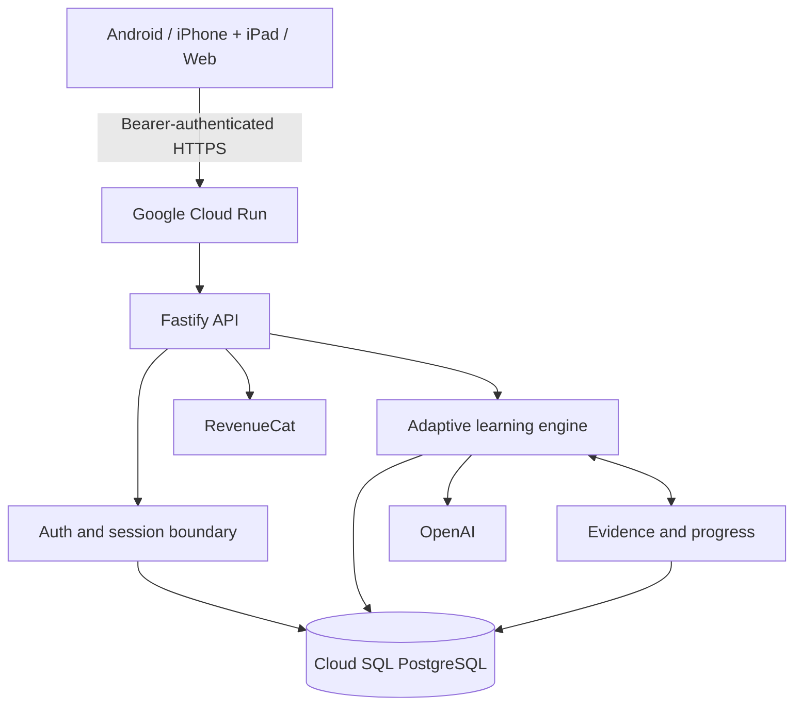

# Architecture

AdaptiveSkills is one product with three client surfaces. Android and iPhone/iPad share an Expo/React Native client; the web workspace uses React and Vite. All clients call the same Fastify API and resume the same PostgreSQL-backed learner record.



## Authoritative state

The API and PostgreSQL own identity, onboarding revision, goals, selected scope, generated units and teaching, lesson position, notes, markers, doubts, lab drafts, runs, hints, evidence, entitlement reconciliation, and continuation state. Clients may cache a session, but they do not decide whether a unit, lab, or paid runway is active.

This boundary provides cross-platform continuity: a learner can save on one client and reload the same state on another. Optimistic revisions protect versioned onboarding and scope writes. Generated teaching and lab state are persisted so ordinary navigation never recreates them.

## External systems

- **Cloud Run** hosts the Node.js/Fastify API and connects to Cloud SQL through the configured socket or TCP URL.
- **Cloud SQL PostgreSQL** stores application state and migration history.
- **OpenAI** performs server-side structured reasoning for scope, teaching, labs, and continuation. Its key never reaches a client.
- **RevenueCat** supplies native packages and localized pricing. The backend reconciles entitlements before access changes.
- **Vercel** serves the static web build; it does not host a second backend.
- **Expo EAS** builds the shared Android/iOS client.

## Monorepo boundaries

`packages/contracts` owns shared schemas and types. `packages/domain` is the domain boundary. `packages/db` owns PostgreSQL access and migrations. `services/api` composes those packages. `apps/mobile` and `apps/web` consume API contracts without duplicating backend rules.

The production build order is deterministic:

```text
contracts → domain → db → api
```
